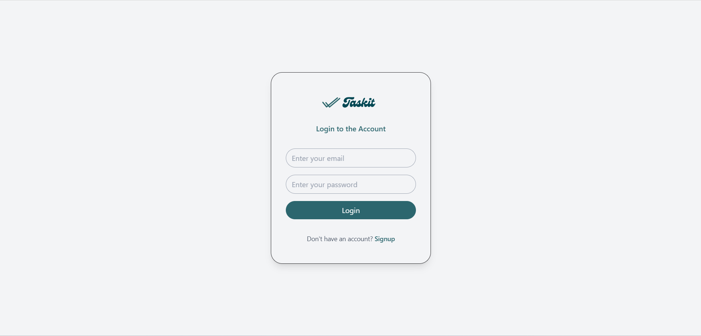
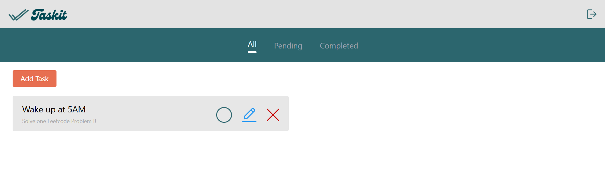

# 🚀 Taskit – Full-Stack Task Management System

Taskit is a production-ready, full-stack task management web application built using the **MERN stack**. It provides a seamless experience for users to create, track, and manage their productivity with secure authentication and a responsive dashboard.

#### Project Link: [View Project](https://mern-taskit.vercel.app/)

---
## 📸 Screenshots

## 🎯 Project Overview
The goal of Taskit was to build a real-world productivity tool while mastering the complexities of frontend-backend integration, state management, and cloud deployment.

### Key Objectives:
* **Full-Stack Integration:** Connecting a React frontend with a Node/Express backend.
* **Secure Auth:** Implementing user registration and login with protected data access.
* **CRUD Mastery:** Full Create, Read, Update, and Delete operations for task data.
* **Cloud Deployment:** Transitioning from a `localhost` environment to a live production URL.

---

## 🏗️ System Architecture
Taskit follows a **3-Tier Architecture**:

1.  **Presentation Layer (Frontend):** React.js & Tailwind CSS for a modern, responsive UI.
2.  **Application Layer (Backend):** Node.js & Express.js handling business logic and RESTful APIs.
3.  **Data Layer (Database):** MongoDB Atlas (Cloud) for persistent, scalable storage.

---

## ⚙️ Tech Stack

| Layer | Technology |
| :--- | :--- |
| **Frontend** | React.js, Tailwind CSS, Axios, React Router |
| **Backend** | Node.js, Express.js |
| **Database** | MongoDB, Mongoose (ODM) |
| **Deployment** | Vercel/Netlify (Frontend), Render/Railway (Backend) |

---

## 🔐 Core Features

### 1. Authentication System
* **Secure Onboarding:** User Signup and Login functionality.
* **Data Integrity:** Secure password handling and session/token-based verification.
* **Protected Routes:** Only authenticated users can access their personalized dashboard.

### 2. Task Management (CRUD)
* **Create:** Add tasks with titles, descriptions, and due dates.
* **Read:** Real-time fetching and display of tasks from MongoDB.
* **Update:** Edit task details or toggle "Completed/Pending" status.
* **Delete:** Permanently remove tasks from the database.

### 3. Smart Filtering
* Toggle views between **All**, **Completed**, and **Pending** tasks to stay organized.

---

## 🔄 API Design

**Base URL:** `/api`

| Method | Endpoint | Description |
| :--- | :--- | :--- |
| `POST` | `/auth/signup` | Register a new user |
| `POST` | `/auth/login` | Authenticate user & start session |
| `GET` | `/tasks` | Retrieve all tasks for the user |
| `POST` | `/tasks` | Create a new task |
| `PUT` | `/tasks/:id` | Update task status or content |
| `DELETE` | `/tasks/:id` | Remove a task |

---

## ⚠️ Challenges & Solutions

Building Taskit involved overcoming several real-world development hurdles:
* **CORS Configuration:** Resolved cross-origin issues during deployment to allow the frontend to talk to the backend.
* **Environment Variables:** Managed sensitive API keys and DB strings using `.env` files for security.
* **Async State Sync:** Handled race conditions and loading states in React to ensure the UI stays in sync with the database.
* **Production Routing:** Fixed issues with React Router paths returning 404s on refresh after deployment.

---

## 🚀 Getting Started

1.  **Clone the repo:** `git clone https://github.com/Deepak-132006/MERN-Task-Manager.git`
2.  **Install Backend Dependencies:** `cd backend && npm install`
3.  **Install Frontend Dependencies:** `cd frontend && npm install`
4.  **Set Environment Variables:** Create a `.env` file in the backend root with your `MONGO_URI` and `PORT`.
5.  **Run the App:** `npm run dev` (using concurrently) or start them separately.

---

## 💼 Contact
**Deepak N** - [www.linkedin.com/in/deepak-n-b416bb309] - [deepakn132006@gmail.com]
